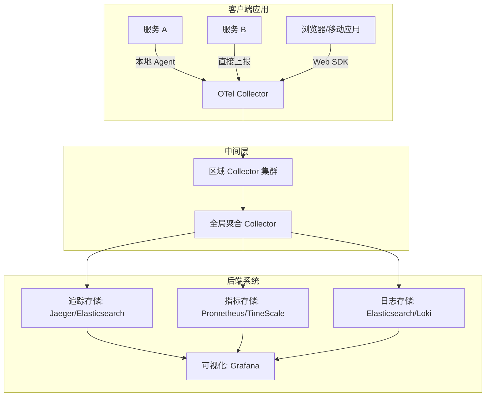
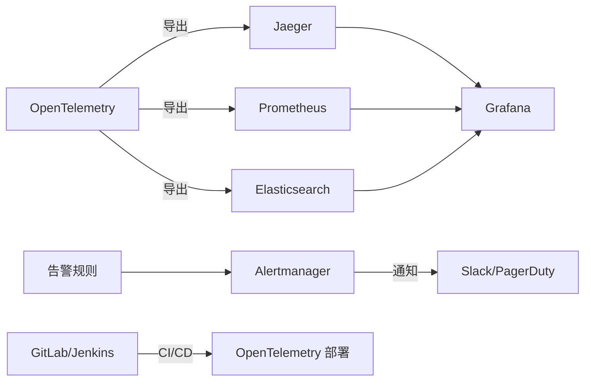

# 性能优化策略
## 采样与过滤
```yaml
# 基于速率的采样配置
processors:
  batch:
    timeout: 1s
  memory_limiter:
    limit_mib: 2048
    spike_limit_mib: 512
    check_interval: 5s
  sampling:
    tail_sampling:
      policy_configs:
        - name: error_sampling
          type: status_code
          status_code:
            status_codes: [ERROR]
            enabled: true
        - name: probabilistic_sampling
          type: probabilistic
          probabilistic:
            sampling_percentage: 5.0  # 5% 采样率
```
## 批处理与压缩
```yaml
# 优化数据传输配置
processors:
  batch:
    timeout: 500ms  # 批处理超时时间
    send_batch_size: 1000  # 每批发送的最大数量
exporters:
  otlp:
    endpoint: otel-collector:4317
    compression: gzip  # 启用压缩
    timeout: 30s
```

